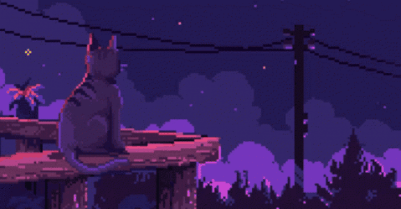

# Ayakiro's Here! 🔥

**Young Web Developer | ML Engineer | 3D Artist**

*Creating worlds and spaces for you, turning dreams and fantasies into crystal-clear reality*

---

## About Me 

I'm a passionate developer who loves to build innovative solutions and create immersive digital experiences. Whether it's crafting elegant web applications, diving into machine learning, or bringing 3D worlds to life, I'm always exploring new technologies and pushing boundaries.

**Founder and Developer of the Aetheris Ecosystem**

---

## 🛠️ Tech Stack

### 💻 Programming Languages

### 🎨 Frameworks & Libraries

### 🖥️ Operating Systems

### 🎯 Tools & Software

---

## 🌟 Featured Projects

### 🚀 [Aetheris Ecosystem](https://github.com/ayakiro/Aetheris-shadcn)
*Modern community platform for developers with articles, courses, networking, and gamification*

---

## 🎨 What I Do

- 💻 **Web Development** - Building modern, responsive web applications
- 🤖 **Machine Learning** - Exploring AI/ML solutions with PyTorch
- 🎨 **3D Art & Design** - Creating immersive 3D worlds with Blender and Unreal Engine
- 🚀 **Full-Stack Development** - End-to-end application development
- 🎯 **Open Source** - Contributing to and maintaining open-source projects

---

## 📈 Current Focus

- 🔥 Building and expanding the **Aetheris Ecosystem**
- 🎓 Learning advanced ML techniques
- 🎨 Creating stunning 3D environments
- 💡 Exploring new web technologies

---

## 🤝 Let's Connect

---

  
<h3 align="center">My stats</h3>

  
  

